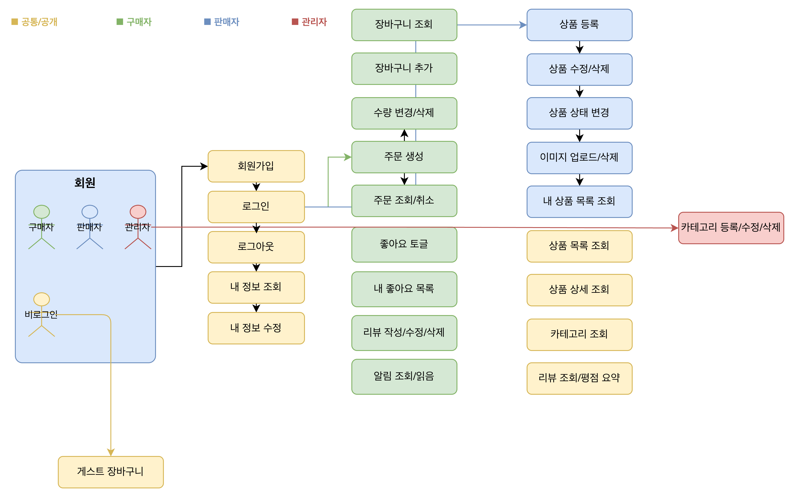
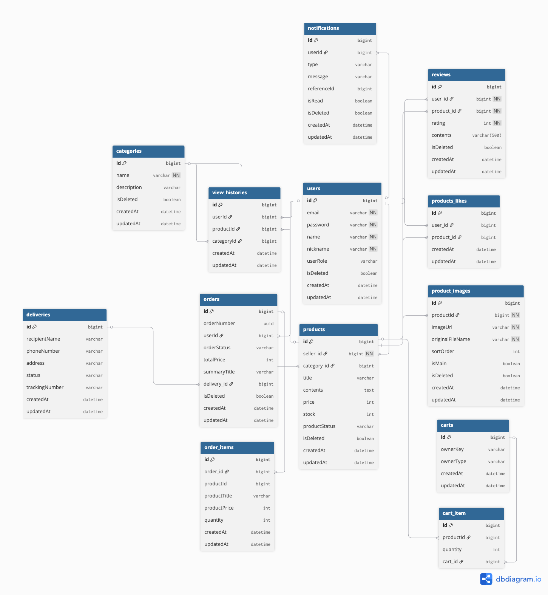
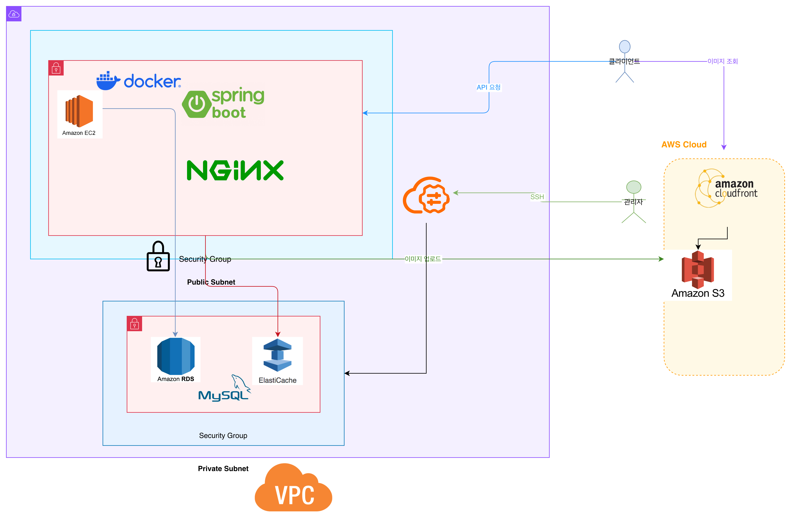
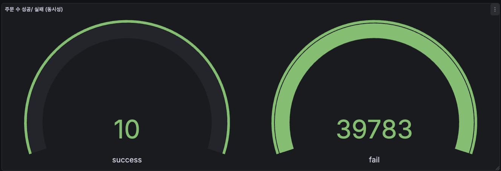
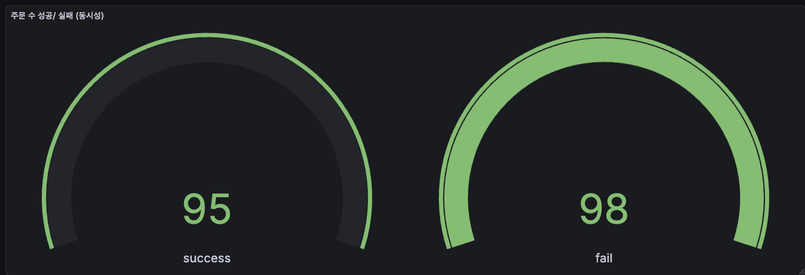
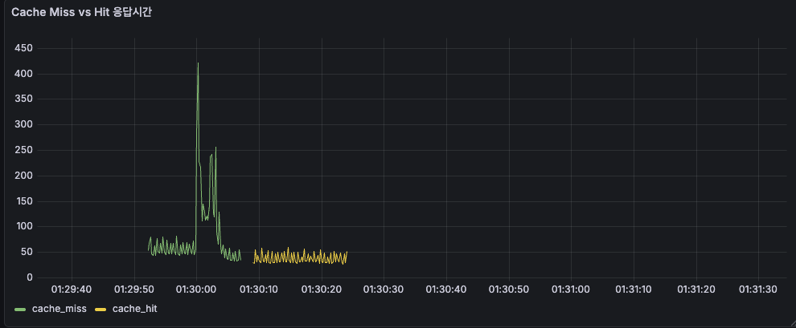

# 🛒 sagopalgo (사고팔고)

## 🖥️ 프로젝트 소개

> **중고거래 앱과 리셀 문화가 확산**되며, 개인 간 안전하고 빠른 거래에 대한 허들이 낮아지고 있습니다.
> 동시에 소규모 사업자도 손쉽게 상품을 등록하고 판매할 수 있는 플랫폼 수요가 증가하고 있다.
>
> sagopalgo에서는 **누구나 판매자이자 구매자**가 될 수 있습니다.
> 개인은 중고 물품을 쉽게 등록하고 거래할 수 있고,
> 사업자는 상품을 지속적으로 판매하며 고객을 확보할 수 있습니다.
>
> **거래는 간단하게, 구매는 안전하게.**

---

## 📜 목차

- [📌 핵심 기능](#-핵심-기능)
- [🗒️ 설계 문서](#️-설계-문서)
- [🔔 개발 규칙](#-개발-규칙)
- [🛠️ 기술스택](#️-기술스택)
- [📢 기술적 의사결정](#-기술적-의사결정)
- [📈 테스트 결과](#-테스트-결과)
- [🚩 트러블슈팅](#-트러블슈팅)

---

## 📌 핵심 기능



<details>
<summary><b>인증인가 / Auth</b></summary>

**기능**
- 로그인
- 로그아웃
- 로그인 연장

**설명**
- JWT와 Spring Security를 도입하여 토큰 방식의 인증/인가를 구현하였습니다.
- RefreshToken을 Redis에 저장하여 로그인 연장과 토큰 블랙리스트 관리를 통해 보안을 강화하였습니다.

</details>

<details>
<summary><b>회원 / User</b></summary>

**공통 기능**
- 회원가입 / 회원탈퇴 / 내 정보 조회·수정

**구매자**
- 상품 목록 및 상세를 조회할 수 있습니다.
- 장바구니에 상품을 담고 주문을 진행할 수 있습니다.
- 내 주문 내역을 전체 조회 또는 단건 조회할 수 있습니다.
- 주문을 취소할 수 있습니다. (배송 준비 전까지)

**판매자**
- 상품을 등록, 수정, 삭제할 수 있습니다.
- 상품 상태 및 재고를 관리할 수 있습니다.
- 상품 이미지를 업로드하고 삭제할 수 있습니다.

**관리자**
- 카테고리를 등록, 수정, 삭제할 수 있습니다.
- 전체 주문 내역을 조회하고 상태를 변경할 수 있습니다.

</details>

<details>
<summary><b>상품 / Product</b></summary>

**판매자**
- 상품을 등록, 조회, 수정, 삭제할 수 있습니다.
- 상품 재고 및 상태(IN_STOCK / OUT_OF_STOCK)를 관리할 수 있습니다.
- 상품 이미지를 업로드하고 삭제할 수 있습니다.

**공통 (비로그인 포함)**
- 상품 목록을 카테고리/상태 기준으로 필터링하여 조회할 수 있습니다.
- 상품 상세 정보를 확인할 수 있습니다.

</details>

<details>
<summary><b>주문 / Order</b></summary>

**구매자**
- 상품 구매를 위한 주문을 진행할 수 있습니다.
- 내 주문 내역을 전체 조회 또는 단건 조회할 수 있습니다.
- 주문을 취소할 수 있습니다.

**관리자**
- 전체 주문 내역을 조회할 수 있습니다.
- 주문 상태를 변경할 수 있습니다. (주문 → 결제 → 배송 → 완료)

</details>

<details>
<summary><b>장바구니 / Cart</b></summary>

**구매자 (로그인)**
- 장바구니에 상품을 추가할 수 있습니다.
- 장바구니 상품 목록을 조회할 수 있습니다.
- 장바구니 상품 수량을 변경하거나 삭제할 수 있습니다.

**비로그인 (게스트)**
- 로그인 없이도 게스트 장바구니를 이용할 수 있습니다.
- 로그인 사용자와 동일하게 상품 추가, 수량 변경, 삭제가 가능합니다.

</details>

<details>
<summary><b>좋아요 / Like</b></summary>

- 상품에 좋아요를 추가하거나 취소(토글)할 수 있습니다.
- 내가 좋아요한 상품 목록을 조회할 수 있습니다.
- 특정 상품의 좋아요 여부를 확인할 수 있습니다.

</details>

<details>
<summary><b>리뷰 / Review</b></summary>

**구매자**
- 구매한 상품에 리뷰를 작성할 수 있습니다.
- 작성한 리뷰를 수정하거나 삭제할 수 있습니다.
- 내가 작성한 리뷰 목록을 조회할 수 있습니다.

**공통 (비로그인 포함)**
- 상품별 리뷰 목록을 조회할 수 있습니다.
- 상품의 평균 평점 등 리뷰 요약 정보를 확인할 수 있습니다.

</details>

<details>
<summary><b>알림 / Notification</b></summary>

- 알림 목록을 페이징으로 조회할 수 있습니다.
- 읽지 않은 알림 수를 확인할 수 있습니다.
- 특정 알림 또는 모든 알림을 읽음 처리할 수 있습니다.

</details>

<details>
<summary><b>배송 / Delivery · 카테고리 / Category · 최근 본 상품 / ViewHistory</b></summary>

**배송**
- 주문 생성 시 자동으로 배송 정보가 생성됩니다.
- 주문 상태 변경에 따라 배송 상태가 연동됩니다. (PENDING → PREPARING → SHIPPED → DELIVERED)

**카테고리**
- 관리자: 카테고리를 등록, 수정, 삭제할 수 있습니다.
- 공통(비로그인 포함): 전체 카테고리 목록 및 단건 조회할 수 있습니다.

**최근 본 상품**
- 상품 상세 조회 시 자동으로 조회 이력이 기록됩니다.
- 카테고리 및 상품 기반으로 사용자 관심 데이터를 수집합니다.

</details>

---

## 🗒️ 설계 문서

| 문서 | 링크 |
|---|---|
| ERD | 아래 이미지 참고 |
| 와이어프레임 | https://sagopalgo-front.vercel.app/ |
| API 명세 (Swagger) | http://13.124.133.122:8080/swagger-ui/index.html |
| 아키텍처 | 아래 이미지 참고 |

**ERD**



**아키텍처**



---

## 🔔 개발 규칙

<details>
<summary><b>공통 응답 형식</b></summary>

공통 에러는 ENUM으로 처리합니다.

```java
public enum ErrorCode {
    UNEXPECTED_ERROR(HttpStatus.INTERNAL_SERVER_ERROR, "알 수 없는 에러가 발생하였습니다."),
    METHOD_NOT_ALLOWED(HttpStatus.METHOD_NOT_ALLOWED, "지원하는 HTTP 메서드가 아닙니다."),
    INVALID_TOKEN(HttpStatus.UNAUTHORIZED, "유효하지 않은 토큰입니다."),
    INVALID_REQUEST(HttpStatus.BAD_REQUEST, "요청 형식이 올바르지 않습니다."),
    VALIDATION_ERROR(HttpStatus.BAD_REQUEST, "입력 값이 유효하지 않습니다."),
}
```

**성공 응답**
```json
{
    "success": true,
    "message": "성공 메시지",
    "data": {},
    "timestamp": "2024-03-21T10:00:00Z"
}
```

**실패 응답**
```json
{
    "success": false,
    "message": "유효하지 않은 토큰입니다.",
    "data": null,
    "timestamp": "2024-03-21T10:00:00Z"
}
```

</details>

<details>
<summary><b>자바 코드 스타일</b></summary>

| 대상 | 규칙 | 예시 |
|---|---|---|
| 패키지 | 소문자 연속 단어 | `com.example.deepspace` |
| 클래스 | UpperCamelCase, 명사/명사구 | `OrderService` |
| 메서드 | lowerCamelCase, 동사/동사구 | `sendMessage()` |
| 상수 | CONSTANT_CASE | `MAX_RETRY_COUNT` |
| 파라미터 | lowerCamelCase, public 메서드에서 단일 문자 파라미터 지양 | `userId` |

</details>

<details>
<summary><b>디렉토리 구조</b></summary>

```
com.example.project
 ├── domain     # 도메인 모듈 계층
 └── global     # 공통 모듈 계층
```

**global 하위 패키지**
```
global
├── common
├── config
├── error
├── util
└── security
```

**domain 하위 패키지**
```
domain
├── controller
│   └── dto
├── service
│   ├── usecase
│   └── facade
├── domain
│   ├── model
│   └── repository
└── exception
```

</details>

<details>
<summary><b>Git 커밋 컨벤션</b></summary>

**브랜치 전략**

| 브랜치 | 역할 |
|---|---|
| `main` | 배포 브랜치 |
| `release` | 배포 전 테스트 브랜치 (QA) |
| `dev` | 통합 개발 브랜치 |
| `feature/이니셜-기능명` | 개인별 기능 작업 브랜치 |

**커밋 타입**

```
feat     : 새로운 기능 추가
fix      : 버그 수정
refactor : 리팩토링 (기능 변경 X)
test     : 테스트 코드 추가/수정
chore    : 빌드 설정 변경
docs     : 문서 수정
comment  : 주석 추가 및 변경
rename   : 파일/폴더명 수정
remove   : 파일 삭제
style    : 코드 포맷팅, 세미콜론 등 스타일 변경
merge    : 파일 병합
```

**커밋 메시지 형식**

```
<type>(<scope>): <subject>

<body>

<footer>
```

**예시**

```
feat(#1): 댓글 목록을 포함하는 게시글 검색 API 구현
fix(#2): 유효하지 못한 게시글 생성 요청의 잘못된 응답 문구 수정
refactor(#4): 불변성을 가져야하는 입력 파라미터에 final 처리
```

</details>

---

## 🛠️ 기술스택

| 분류 | 기술 |
|---|---|
| **Language** | Java 17 |
| **Backend** | Spring Boot, Spring Data JPA, QueryDSL, Lombok |
| **Security** | Spring Security, JWT |
| **Database** | MySQL, Redis |
| **Cache / Lock** | Redisson, Spring Cache |
| **Infrastructure** | AWS EC2, AWS RDS, AWS ElastiCache, AWS S3, CloudFront, Docker, Nginx |
| **Monitoring** | Prometheus, Grafana, InfluxDB |
| **CI/CD** | GitHub Actions, Docker Hub |
| **Test** | Postman, K6 |
| **Docs** | Spring REST Docs, Swagger |
| **Design** | DBdiagram.io, draw.io |
| **Collaboration** | GitHub, Notion |

---

## 📢 기술적 의사결정

### 💬 실시간 알림 - WebSocket vs SSE

#### 문제 발생 배경

주문 생성, 배송 상태 변경 등 서버 이벤트 발생 시 사용자에게 실시간 알림을 전달해야 했다.
단순 새로고침·폴링 방식은 불필요한 요청을 유발하므로, 지속 연결 기반의 실시간 전송 방식을 검토했다.

#### 기술 비교

| 항목 | SSE | WebSocket |
|---|---|---|
| 통신 방향 | 서버 → 클라이언트 단방향 | 양방향 |
| 프로토콜 | HTTP | ws:// |
| 연결 관리 | SseEmitter를 Map으로 직접 관리 | STOMP 프레임워크 수준에서 라우팅 |
| 재연결 | 자동 | 수동 구현 필요 |
| 사용자 식별 | Map<userId, SseEmitter> 직접 관리 | `/user/{userId}/queue/...` 내장 지원 |
| 확장성 | 단순 알림에 적합 | 채팅·입찰 등 복잡한 통신으로 확장 가능 |

#### 선택: WebSocket + STOMP

1. **사용자별 라우팅**: SSE는 `Map<userId, SseEmitter>`를 직접 유지·관리해야 한다. STOMP는 `/user/{userId}/queue/notifications` 형태로 특정 사용자에게만 메시지를 전달하는 구조를 프레임워크 수준에서 지원하여 연결 관리 코드가 불필요하다.

2. **기능 확장성**: 현재는 서버→클라이언트 단방향 알림만 필요하지만, 향후 채팅·입찰 기능으로 확장될 경우 SSE로는 불가능하다. 멀티 인스턴스 환경에서는 Redis Pub/Sub 또는 Kafka 브로커 연동으로 확장 가능하도록 설계했다.

#### 구현 포인트

**1. JWT 인증 - STOMP CONNECT 시점 검증**

WebSocket 연결 이후에는 일반 HTTP Security 필터가 동작하지 않는다.
`ChannelInterceptor`를 구현한 `WebSocketAuthInterceptor`에서 CONNECT 프레임 수신 시 JWT를 검증하고 사용자 Principal을 설정하여, 인증된 사용자만 구독할 수 있도록 처리했다.

**2. DB 저장 + WebSocket 전송 동시 처리**

WebSocket만 사용하면 연결이 끊긴 오프라인 사용자는 알림을 유실한다. DB 저장과 WebSocket 전송을 하나의 트랜잭션 내에서 함께 처리했다.

```java
@Transactional
public void send(Long userId, NotificationType type, String message, Long referenceId) {
    Notification notification = Notification.of(userId, type, message, referenceId);
    notificationRepository.save(notification); // 1. DB 영속화 (오프라인 대비)

    messagingTemplate.convertAndSendToUser(    // 2. 실시간 전송
        userId.toString(),
        "/queue/notifications",
        NotificationResponseDto.from(notification)
    );
}
```

- 접속 중인 사용자: WebSocket으로 즉시 수신
- 오프라인 사용자: DB에 저장된 알림을 로그인 후 조회

---

### 🛒 게스트 장바구니 - OwnerType 통합 설계

#### 문제 발생 배경

비로그인 상태에서도 장바구니를 이용할 수 있어야 했다.
단, JWT 기반 Stateless 구조를 유지하면서 서버 측 재고·가격 검증도 함께 보장해야 했다.

#### 기술 비교

| 방식 | 설명 | 판단 |
|---|---|---|
| localStorage | 프론트에서 관리 | 서버 검증 불가 → 재고·가격 정합성 보장 어려움 |
| 세션 기반 | 서버 세션에 저장 | Stateless JWT 구조와 충돌 |
| 로그인 전용 | 비로그인 차단 | UX 저하, 전환율 감소 |
| OwnerType Enum | USER/GUEST 추상화 후 DB 저장 | ✅ 채택 |

#### 선택: OwnerType Enum 통합 설계

Cart 엔티티에 `ownerType(USER/GUEST)` + `ownerKey`를 두어 단일 구조로 회원·게스트를 식별한다.

- `USER`: `ownerKey = userId`
- `GUEST`: `ownerKey = guestKey (UUID, 쿠키 발급)`

```java
// 로그인 유저
cartService.addItemToCart(OwnerType.USER, userId.toString(), requestDto);

// 게스트
cartService.addItemToCart(OwnerType.GUEST, guestKey, requestDto);

// → 동일한 Service 메서드 재사용. USER일 때만 본인 상품 담기 검증 분기 처리
if (ownerType == OwnerType.USER && product.isSeller(Long.parseLong(ownerKey))) {
    throw new CartException(CartErrorCode.OWN_PRODUCT_CART_EXCEPTION);
}
```

#### 장점

- **코드 재사용**: USER/GUEST 별도 Service 없이 단일 메서드로 처리. 추가/조회/삭제/수량변경 4개 기능 모두 중복 없이 공유
- **서버 검증**: DB 저장 방식으로 재고·가격·상품 상태를 서버에서 검증
- **Stateless 유지**: 세션 없이 쿠키 기반 guestKey로 게스트를 식별하여 JWT 인증 구조와 충돌 없음

#### 한계 및 개선 방향

- **장바구니 병합 미구현**: 게스트 상태에서 담은 상품이 로그인 후 자동으로 사용자 장바구니에 병합되지 않는다. OwnerType 통합 설계 덕분에 `guestKey → userId` 이전 로직 추가만으로 구현 가능한 구조이나, 현재 미적용 상태다.
- **ownerKey 타입 안전성**: userId(Long)와 guestKey(UUID)를 모두 `String`으로 통일하여 컴파일 타임 타입 검증이 없다. 향후 제네릭 기반 `CartOwner` 인터페이스로 분리하면 개선 가능하다.

---

## 📈 테스트 결과

### 🤼 동시성 제어 테스트

#### 1. 테스트 목표

- 재고가 한정된 상품에 대량의 동시 주문이 들어올 때 재고 정합성이 보장되는지 확인
- 이전 프로젝트에서 비관락으로 해결했으나 인식한 한계를 Redisson 분산락으로 실제 해소

#### 2. 테스트 배경

이전 프로젝트에서 포인트 차감 로직의 동시성 이슈를 해결하는 과정에서 비관락을 선택한 경험이 있음.
비관락으로 데이터 정합성은 확보했으나 아래 한계를 인식:

- **DB 커넥션 풀 고갈**: 동시 요청이 많을수록 SELECT FOR UPDATE가 커넥션을 오래 점유하여 응답 지연 발생
- **분산 환경 확장 불가**: 스케일 아웃 시 DB 락 경합이 병목이 되어 확장성이 떨어짐
- **데드락 재발 가능성**: 비관락 도입 자체가 처음 해결하려 했던 데드락 위험을 다시 내포

> "추후 확장 시에는 Redis를 이용한 분산락으로 전환이 필요하다"는 것을 인식했지만 당시에는 도입하지 못하고 넘어감

#### 3. 테스트 환경

- K6, JDK 17, Spring Boot 3.5.3, MySQL 8.0
- Redis Redisson 3.23.2
- AWS EC2 (t3.micro), AWS ElastiCache (Redis)

#### 4. 테스트 대상

- Pessimistic Lock (비관적 락)
- Distributed Lock (Redisson 분산 락)

#### 5. 다른 방식 제외 이유

| 방식 | 제외 이유 |
|---|---|
| `synchronized` | 단일 JVM에서만 유효하여 멀티 인스턴스(분산 환경)에서 동시성 제어 불가 |
| 낙관적 락 | 충돌이 많은 재고 차감 시 재시도/실패 처리 비용이 커져 지연 및 부하 증가 |

#### 6. 테스트 시나리오

**A. 정합성 검증 (재고 10, 1000 VU)**

재고 10개인 상품을 대상으로 1,000명이 동시에 주문을 시도하는 플래시 세일 상황을 가정.

| 조건 | 값 |
|---|---|
| VU (가상 유저) | 1,000명 |
| 단계 | 5초 동안 1,000명으로 급증 → 10초 유지 → 5초 종료 |
| 총 요청 수 | 39,958건 |
| 예상 성공 수 | 10건 (재고 수량과 동일) |

**B. 성능 비교 (재고 100, 200 VU)**

Redisson 분산락과 비관락을 동일 조건에서 테스트하여 응답시간 및 확장성을 비교.

| 조건 | 값 |
|---|---|
| VU | 200명, 각 1회 요청 (shared-iterations) |
| 총 요청 수 | 200건 |
| 예상 성공 수 | 정확히 100건 |

#### 7. 테스트 결과

**A. 정합성 테스트 - Redisson 적용 과정**

| 단계 | 조건 | 성공 | 실패 | 정합성 |
|---|---|---|---|---|
| 분산락 미적용 | 50 VU, 재고 10개 | 50 | 0 | ❌ 재고 초과 |
| 분산락 적용 (경계 미분리) | 50 VU, 재고 10개 | 50 | 0 | ❌ 경계 문제 |
| OrderFacade 적용 (경계 분리) | 1,000 VU, 재고 10개 | 10 | 39,948 | ✅ 보장 |

> 실패 주문은 재고 부족에 따른 정상적인 비즈니스 실패(예: 409 응답)이며, 서버 오류(5xx)와 구분하여 집계



| 지표 | 값 |
|---|---|
| 총 요청 수 | 39,958건 |
| 성공 주문 | 10건 |
| 실패 주문 | 39,948건 |
| avg 응답시간 | 199ms |
| p95 응답시간 | 16.74ms |
| 테스트 소요시간 | 47s |

**B. 성능 비교 테스트**



| 구분 | Redisson 분산락 | Pessimistic Lock | 개선율 |
|---|---|---|---|
| 재고 정합성 | ✅ 100 / 100 | ✅ 100 / 100 | - |
| avg 응답시간 | 2.85s | 7.70s | **63.0% ↓** |
| p95 응답시간 | 5.67s | 10.03s | **43.5% ↓** |
| 임계값 (p95 < 10s) | ✅ 통과 | ❌ 실패 | - |
| 테스트 소요시간 | 6.4s | 10.7s | **40.2% ↓** |

#### 8. 결론

- 재고 차감과 같이 동시성이 높은 도메인에서는 **락 해제 시점과 트랜잭션 커밋 시점의 경계**를 반드시 고려
- 이전 프로젝트에서 인식했던 비관락의 한계(DB 커넥션 풀 고갈, 분산 환경 확장성 병목)를 Redisson 분산락 도입으로 구조적으로 완화

<details>
<summary><b>장단점 및 개선점</b></summary>

**장점**
- 락 경합을 Redis 레이어에서 처리하여 DB 부하 분리
- 서버 증설 후에도 동일하게 동작하는 분산 환경 친화적 구조
- waitTime, leaseTime 등 락 동작을 세밀하게 제어 가능

**단점**
- **Redis 단일 장애점(SPOF)**: Redis 서버 다운 시 락 획득 불가 → 주문 전체 차단 위험
- **네트워크 오버헤드**: 매 요청마다 Redis 통신이 추가되어 단일 서버 환경에서는 오히려 응답시간이 늘어날 수 있음
- **구현 복잡도**: AOP, SpEL, 트랜잭션 경계 등을 정확히 이해하고 설정해야 하며, 잘못 적용 시 락이 무의미해짐

**개선점**
- Redis 이중화(Sentinel, Cluster) 구성으로 SPOF 위험 완화 가능
- 현재 단일 ElastiCache 노드로 운영 중이며, 트래픽 증가 시 이중화 전환이 필요함

</details>

---

### 💾 캐시 성능 테스트

#### 1. 테스트 목표

상품 목록 조회 API에 ElastiCache 캐싱 도입 후, DB 직접 조회(캐시 미스) 대비 캐시 히트 시 응답속도 개선 효과를 수치로 검증.

#### 2. 테스트 환경

K6 / AWS EC2 (부하 생성) / AWS RDS (MySQL) / AWS ElastiCache (Redis)

#### 3. 테스트 대상

`GET /api/products?page={page}&size=10&sort=popular`

`sort=popular` 조건은 좋아요 수 기준 GROUP BY + COUNT 집계 쿼리가 실행되는 가장 무거운 조회 패턴.

#### 4. 테스트 시나리오

| 시나리오 | 파라미터 전략 | 의도 |
|---|---|---|
| 캐시 미스 | VU 번호 × 반복횟수로 매 요청 고유 `page` 생성 | 캐시 생성 방지 → DB 직접 조회 강제 |
| 캐시 히트 | 모든 VU가 동일 파라미터 (`page=0`) 반복 | 첫 요청 이후 전부 ElastiCache 조회 |

두 시나리오를 순차 실행(캐시 미스 15s → 17s 대기 → 캐시 히트 15s)해 동일 서버 환경에서 공정하게 비교.

#### 5. 테스트 결과



| 지표 | 캐시 미스 (DB 직접 조회) | 캐시 히트 (ElastiCache) | 개선율 |
|---|---|---|---|
| 평균 | 92.01ms | 43.63ms | **52.6% 감소** |
| P90 | 138.25ms | 57.07ms | **58.7% 감소** |
| P95 | 159.68ms | 108.04ms | **32.4% 감소** |

#### 6. 결론

- 평균·P90·P95 모두 목표 기준(30% 이상)을 초과 달성
- 동일 파라미터 반복 요청이 많은 실제 서비스 환경에서는 캐시 히트율이 높아질수록 DB 부하 감소 효과도 함께 증가할 것으로 예상

**한계점**
- 테스트 환경 특성상 매 실행마다 응답시간 편차가 존재하며, 실제 서비스 트래픽 패턴과 차이가 있음
- 현재 캐시 eviction 시 keys 패턴 삭제 방식을 사용 중으로, 대규모 환경에서는 scan 방식으로 전환이 필요함

---

## 🚩 트러블슈팅

### 🔄 분산락 - 트랜잭션 경계 불일치

#### 1. 문제 상황

Redisson 분산락을 적용했음에도 재고 10개인 상품에 50명 전원이 주문에 성공하는 동시성 문제가 지속됨.

```java
// 분산락 적용 후 테스트 결과
successful_orders: 50  // ← 재고는 10개인데 50명 전원 성공
failed_orders:      0
```

#### 2. 원인 분석

`@DistributedLock`과 `@Transactional`이 동일한 Bean에 선언되어 있어, AOP 실행 순서상 **락이 먼저 해제된 뒤 트랜잭션이 커밋**되는 타이밍 문제가 발생하였다.

```
1. 🔵 Thread-1: 분산락 획득
2. 🔵 Thread-1: 트랜잭션 시작
3. 🔵 Thread-1: 재고 10 → 9 감소 (DB 미커밋 상태)
4. 🔵 Thread-1: 분산락 해제  ← 락 해제
5. 🟢 Thread-2: 분산락 획득  ← 아직 Thread-1 커밋 전
6. 🟢 Thread-2: 재고 조회 → 여전히 10 읽음
7. 🔵 Thread-1: 트랜잭션 커밋
8. 🟢 Thread-2: 재고 10 → 9 감소 (중복 차감)
```

> `@Transactional`의 기본 전파 수준인 `REQUIRED`로 인해 `StockService.decreaseStock()`이 `OrderService`의 트랜잭션에 합류하게 되고, 락이 해제된 시점에도 트랜잭션은 아직 열려 있는 상태였다.

#### 3. 해결 과정

| 방법 | 설명 | 판단 |
|---|---|---|
| `REQUIRES_NEW` 독립 트랜잭션 | 재고 차감만 별도 트랜잭션으로 즉시 커밋 | 외부 트랜잭션 롤백 시 재고가 복구되지 않는 정합성 위험 |
| `TransactionSynchronizationManager.afterCommit()` | 커밋 후 락 해제를 직접 제어 | AOP 내부 구현에 직접 개입하여 결합도 증가 |
| `OrderFacade` 패턴 | 락 담당 계층과 트랜잭션 담당 계층을 분리 | SRP 준수, 명확한 계층 분리, 확장성 우수 → **채택** |

**OrderFacade 패턴 적용**

```java
// ✅ OrderFacadeImpl - 락만 담당, @Transactional 없음
@Component
public class OrderFacadeImpl implements OrderFacade {

    @Override
    @DistributedLock(key = "'product:' + #requestDto.items[0].productId")
    public OrderCreateResponseDto createOrder(Long userId, OrderCreateRequestDto requestDto) {
        return orderService.createOrder(userId, requestDto); // 내부에서 트랜잭션 열고 커밋
    }
}

// ✅ OrderService - 트랜잭션만 담당
@Transactional
public OrderCreateResponseDto createOrder(Long userId, OrderCreateRequestDto requestDto) {
    // 재고 차감, 주문 생성 → 메서드 종료 시 커밋
}
```

```
[수정 후 실행 순서]
1. 🔵 Thread-1: 분산락 획득 (Facade)
2. 🔵 Thread-1: OrderService 호출 → 트랜잭션 시작
3. 🔵 Thread-1: 재고 10 → 9 감소
4. 🔵 Thread-1: 트랜잭션 커밋  ← 먼저 커밋
5. 🔵 Thread-1: 분산락 해제  ← 커밋 후 해제
6. 🟢 Thread-2: 분산락 획득
7. 🟢 Thread-2: 재고 조회 → 9 읽음 (정상)
```

#### 4. 결과

| 항목 | Before | After |
|---|---|---|
| 분산락 위치 | `StockService`에 `@DistributedLock` + `@Transactional` 공존 | `OrderFacade`(락) → `OrderService`(트랜잭션) 계층 분리 |
| 락 해제 시점 | 트랜잭션 커밋 전 해제 | 트랜잭션 커밋 후 해제 |
| 50 VU 동시 주문 | 50명 전원 성공 (정합성 깨짐) | 정확히 10명만 성공 |
| 200 VU 동시 주문 | - | 정확히 10명만 성공 |
| 설계 원칙 | 락과 트랜잭션 책임 혼재 | SRP 준수, 단일 책임 분리 |

#### 5. 회고

- **분산락을 적용했다고 끝이 아니다**: 락이 언제 해제되는지가 더 중요하다. 트랜잭션 커밋 전에 락이 풀리는 순간 락은 유명무실해진다.
- **AOP는 순서가 곧 동작이다**: Spring AOP에서 어드바이스 실행 순서를 정확히 파악하지 않으면 의도와 다르게 동작할 수 있다.
- **계층 분리는 설계 원칙이 아니라 버그 방지책이다**: OrderFacade 패턴이 단순히 클린 아키텍처를 위한 것이 아니라, 타이밍 버그 자체를 구조적으로 막아준다는 것을 실제로 경험했다.

---

### ⚒️ N+1 → QueryDSL 최적화

#### 1. 문제 상황

상품 목록 API(`GET /api/products`) 응답 속도가 느린 현상 발견.
DTO 변환 과정에서 `seller`, `category`에 접근하는 순간 Lazy Loading이 트리거되어 연관 엔티티마다 쿼리 추가 실행.

```sql
-- 상품 10개 조회 시 발생한 쿼리
SELECT * FROM products                    -- 1번
SELECT * FROM users WHERE id = 1          -- N번
SELECT * FROM users WHERE id = 2          -- N번
...
SELECT * FROM categories WHERE id = 1     -- N번
...
-- 총 1 + 10 + 10 = 21개 쿼리
```

#### 2. 원인 분석

Product 엔티티의 `seller`, `category`가 `@ManyToOne(fetch = LAZY)`로 설정되어 있어 DTO 변환 시점에 각각 개별 SELECT 쿼리가 발생.

단순 JOIN FETCH로 해결하려 했으나 추가 요구사항 구현에 어려움이 있었음:
- **5가지 동적 필터**: 카테고리, 키워드, 최소/최대 가격, 판매 상태
- **6가지 정렬 옵션**: 최신순, 가격 오름/내림, 좋아요 수, 인기순(주문 수)
- 좋아요 수·주문 수는 집계 쿼리(COUNT) 필요 → JPQL만으로는 동적 조건 조합과 집계 정렬 처리 복잡도 크게 증가

#### 3. 해결 과정

**❌ Before - JPQL**

```java
// 조건마다 메서드를 별도 생성해야 함
@Query("SELECT p FROM Product p WHERE p.isDeleted = false")
Page<Product> findAllActive(Pageable pageable);

@Query("SELECT p FROM Product p WHERE p.isDeleted = false AND p.categoryId = :categoryId")
Page<Product> findByCategoryId(Long categoryId, Pageable pageable);

// 좋아요 수, 주문 수 정렬 → JPQL로 집계 정렬 구현 불가
```

```java
// 조건 조합이 늘어날수록 분기문 폭발
if (categoryId != null && keyword != null) {
    // categoryId + keyword 조합 메서드 또 필요...
} else if (categoryId != null) {
    products = productRepository.findByCategoryId(categoryId, pageable);
} else if (keyword != null) {
    products = productRepository.findByKeyword(keyword, pageable);
}
// DTO 변환 시점에 N+1 발생
```

**✅ After - QueryDSL**

```java
List<Product> result = queryFactory
    .selectFrom(product)
    .leftJoin(product.seller).fetchJoin()    // N+1 해결
    .leftJoin(product.category).fetchJoin()  // N+1 해결
    .leftJoin(productLike).on(productLike.productId.eq(product.id))
    .leftJoin(orderItem).on(orderItem.productId.eq(product.id))
    .where(
        product.isDeleted.eq(false),
        categoryIdEquals(categoryId, product),  // null이면 조건 제외
        titleContains(keyword, product),
        priceGoe(minPrice, product),
        priceLoe(maxPrice, product),
        statusEquals(status, product)
    )
    .groupBy(product.id, product.seller.id)
    .orderBy(getOrderSpecifier(sort, product, productLike, orderItem))
    .offset(pageable.getOffset())
    .limit(pageable.getPageSize())
    .fetch();
```

```java
// 동적 필터: null 반환 시 QueryDSL이 자동으로 조건에서 제외
private BooleanExpression titleContains(String keyword, QProduct product) {
    return keyword == null || keyword.isBlank()
        ? null
        : product.title.contains(keyword);
}

// 동적 정렬
case "likes_count" -> productLike.count().desc();
case "popular"     -> orderItem.count().desc();
case "latest"      -> product.createdAt.desc();
```

실행 쿼리: **목록 1개 + count 1개 = 총 2개**

#### 4. 결과

| 항목 | Before | After |
|---|---|---|
| 쿼리 수 | 21개 (N+1) | 2개 |
| 필터 | 조건마다 메서드 분리 + if-else | BooleanExpression null로 자동 처리 |
| 정렬 | 가격만 가능 | 좋아요 수·주문 수 집계 정렬 가능 |
| 타입 안전성 | 런타임에 오류 발견 | 컴파일 타임 검증 |

<details>
<summary><b>장단점 및 개선 방향</b></summary>

**장점**
- **N+1 해소**: fetchJoin()으로 seller, category를 단일 쿼리로 조회
- **동적 쿼리**: BooleanExpression null 반환으로 조건 조합을 하나의 메서드로 통합
- **집계 정렬**: leftJoin + groupBy로 좋아요 수·주문 수 기반 정렬을 쿼리 레벨에서 처리
- **타입 안전성**: 컴파일 타임에 오류 검증 가능

**단점**
- **복잡도 증가**: Q클래스 생성, JPAQueryFactory 빈 등록 등 초기 설정 필요
- **컬렉션 fetchJoin + pagination 제약**: 함께 사용 시 HibernateJpaDialect 경고 발생 가능
- **count 쿼리 분리**: 페이지네이션용 count 쿼리를 별도로 작성해야 함

**개선 방향**
- `@BatchSize` 또는 커버링 인덱스 방식으로 추가 최적화 가능
- 검색 트래픽이 커질 경우 Elasticsearch 도입으로 Full-Text Search 전환
- 자주 조회되는 상품 목록에 Redis 캐싱 적용으로 DB 부하 추가 감소

</details>

#### 5. 회고

- **N+1은 코드에서 보이지 않는다**: DTO 변환 코드만 보면 문제가 없어 보이지만, 쿼리 로그를 찍기 전까지 N+1이 발생하고 있다는 것을 알지 못했다. Lazy Loading의 동작 시점을 항상 의식해야 한다.
- **동적 쿼리는 설계가 먼저다**: 조건이 늘어나면서 메서드 조합이 기하급수적으로 증가하는 문제를 직접 경험했다. 초기 설계 단계에서 QueryDSL을 도입했다면 리팩토링 비용이 없었을 것이다.
- **쿼리 최적화는 측정이 기반이다**: "느릴 것 같다"는 감이 아니라, 실제 쿼리 로그와 실행 계획을 통해 병목을 확인하고 개선 전후를 수치로 비교하는 것이 중요하다.

---

### 🔐 Spring Security NPE

#### 1. 문제 상황

로그인 없이 `GET /api/products/me` 호출 시 `500 Internal Server Error` 발생.
비회원도 상품 목록은 조회할 수 있어야 해서 `GET /api/products/**`를 `permitAll()`로 설정했는데, 내 상품 조회 API에서 NPE 발생.

```
java.lang.NullPointerException: userId must not be null
    at ProductService.getMyProducts(ProductService.java:83)
```

#### 2. 원인 분석

`GET /api/products/**` 와일드카드 규칙이 `/api/products/me`까지 포함하여 먼저 매칭.
`authorizeHttpRequests`는 선언 순서대로 평가되며 첫 번째 매칭 규칙이 적용됨.

```java
// ❌ 와일드카드가 /me까지 허용해버림
.requestMatchers(HttpMethod.GET, "/api/products/**").permitAll()
.anyRequest().authenticated()
```

`permitAll()`로 통과된 요청은 Security Context에 인증 정보가 없음
→ `@AuthenticationPrincipal`로 꺼낸 `userId`가 `null`
→ 서비스에서 `userId`를 그대로 사용 → `NullPointerException`

#### 3. 해결 과정

더 구체적인 규칙을 와일드카드보다 먼저 선언.

```java
// ✅ 구체적인 경로를 먼저 선언
.requestMatchers(HttpMethod.GET, "/api/products/me").authenticated()  // 먼저 매칭
.requestMatchers(HttpMethod.GET, "/api/products/**").permitAll()       // 이후 와일드카드
.anyRequest().authenticated()
```

`GET /api/products/me` 요청 → `/api/products/me` 규칙 먼저 매칭 → 인증 필요 → 인증 없으면 **401 반환 (NPE 발생 전 차단)**

**검증**: Swagger UI에서 `Authorization` 헤더 없이 `GET /api/products/me` 호출 시
- 수정 전: `500 Internal Server Error`
- 수정 후: `401 Unauthorized`

#### 4. 결과

| 항목 | Before | After |
|---|---|---|
| 비인증 `GET /api/products/me` | `500 Internal Server Error` (NPE) | `401 Unauthorized` |
| 비인증 `GET /api/products` | `200 OK` | `200 OK` (정상 유지) |
| 비인증 `GET /api/products/1` | `200 OK` | `200 OK` (정상 유지) |
| `@AuthenticationPrincipal userId` | `null` (permitAll 통과) | 컨트롤러 진입 전 차단 |
| 실패 지점 | `ProductService`에서 NPE | Security 필터 단계에서 401 응답 |
| 오류 성격 | 서버 내부 오류 (5xx) | 인증 실패 (4xx) |

#### 5. 회고

- **Security 규칙은 선언 순서가 곧 우선순위다**: `permitAll()`의 와일드카드 범위를 항상 의심해야 한다. 이후 엔드포인트를 추가할 때는 의도치 않게 인증이 우회되는 경로가 생기지 않는지 먼저 확인하는 습관이 생겼다.
- **500이 아니라 401이 나와야 한다**: 인증 실패는 5xx가 아닌 4xx로 응답해야 한다. NPE로 500이 터지는 것은 보안적으로도 잘못된 응답이며, 공격자에게 서버 내부 정보를 노출할 수 있다.
